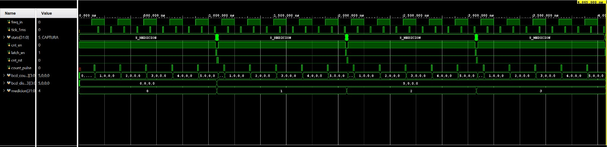

# Frecuencímetro Digital en FPGA — Boolean Board

TP de Laboratorio de Arquitectura (FAMAF). Mide la frecuencia de una señal por el
método directo: cuenta flancos ascendentes durante una ventana de exactamente 1 s
y muestra el resultado en el display de 7 segmentos.

## Estructura

```
src/     Diseño sintetizable
  BaseTime1ms.sv        Bloque 1 - base de tiempo (tick cada 1 ms)
  bcd_counter.sv        Bloque 2 - contador BCD de un dígito con carry_out
  bcd_counter_bank.sv   Bloque 3 - 4 contadores BCD en cascada
  FSM_Control.sv        Bloque 4 - FSM: Medición -> Captura -> Reinicio
  latch_reg.sv          Bloque 5 - registro de retención (FF tipo D)
  Frequency_meter.sv    Bloque 6 - Top Level
  disp7seg_controller.sv  Módulo de display provisto por la cátedra
sim/     Testbenches
  tb_bcd_counter.sv        Test unitario del contador BCD
  tb_frequency_meter.sv    Test de integración (ventana acortada por parámetros)
  wave_frequency_meter.tcl Arma el waveform con las señales relevantes
constrs/
  frecuencimetro.xdc    Pines usados por el diseño
docs/
  boolean_master.xdc    XDC completo de la placa (referencia)
  [GUIA LAB]Lab1_Frecuencimetro.pdf
```

## Cómo funciona

- `BaseTime1ms` divide los 100 MHz y emite un pulso cada 1 ms (100.000 ciclos).
- `FSM_Control` cuenta 1000 de esos ticks: eso arma la ventana de 1 s. Durante ese
  tiempo mantiene `cnt_en = 1`. Al terminar pasa un ciclo por **Captura**
  (`latch_en`) y otro por **Reinicio** (`cnt_rst`), y vuelve a medir.
- En el top, la señal incógnita se sincroniza con dos flip-flops y se le detecta el
  flanco ascendente: cada flanco genera un pulso de un ciclo que habilita al banco
  BCD. Así los contadores son 100% síncronos al clock de la placa.
- El banco encadena 4 contadores BCD: el `carry_out` de las unidades habilita a las
  decenas, y así hasta los millares (rango 0000–9999 Hz).
- El `latch_reg` congela el valor al final de cada ventana, para que el display no
  parpadee mientras se está contando.

## Simulación en Vivado

1. `Flow > Simulation Settings > Simulation top module name` = `tb_frequency_meter`
   (o `tb_bcd_counter`).
2. `Run Simulation > Run Behavioral Simulation`.

Con la simulación abierta, en la consola Tcl de la ventana de simulación:

```tcl
source {sim/wave_frequency_meter.tcl}
```

Eso reinicia, agrega las señales internas que importan (`state`, `cnt_en`,
`latch_en`, `cnt_rst`, `count_pulse`, `bcd_count`, `bcd_disp`) y corre hasta el
final. Después apretá **Zoom Fit**. Lo que hay que ver: `bcd_count` contándo y
volviendo a cero cada ventana, mientras `bcd_disp` se queda quieto en el último
valor medido.

Nota: `D0_SEG` y `D0_AN` quedan en X durante toda la simulación. Es correcto — el
refresco del display divide por 2^14 (~82 us) y el testbench termina a los 4,2 us.

El testbench de integración instancia el top con `DIV_COUNT = 10` y `MS_WINDOW = 10`,
o sea una ventana de 1 µs en vez de 1 s (una ventana real serían 10⁸ ciclos,
imposible de simular). Con una entrada de 200 ns de período deben entrar 5 flancos
por ventana, así que la consola tiene que imprimir `display = 0005`.

### Resultado de la simulación



Cuatro ventanas de medición consecutivas. Los arreglos BCD se leen
`[unidades, decenas, centenas, millares]`, o sea que `5,0,0,0` es el número 0005.
Cada fila confirma un punto de la consigna:

| Señal | Qué demuestra |
|---|---|
| `state` | Pasa casi todo el tiempo en `S_MEDICION` y cae un instante en `S_CAPTURA` y `S_REINICIO` al cerrar cada ventana. Es la secuencia estricta que pide el Bloque 4. |
| `cnt_en` | Alto durante toda la ventana, bajo en esos dos ciclos: los contadores no cuentan mientras se captura y se reinicia. |
| `latch_en` / `cnt_rst` | Pulsos de **un** ciclo, y primero captura, después reinicia. Si fuera al revés, el registro guardaría ceros. |
| `count_pulse` | Cinco pulsos angostos por ventana, uno por cada flanco ascendente de `freq_in`. Nunca anchos ni dobles: el sincronizador y el detector de flanco funcionan. |
| `bcd_count` | Sube `1,0,0,0` → `5,0,0,0` y vuelve a cero al inicio de cada ventana. Cuenta y se reinicia. |
| `bcd_disp` | Vale `0,0,0,0` en la primera ventana (todavía no se midió nada) y `5,0,0,0` desde la primera captura en adelante, **plano** mientras `bcd_count` ya está contando de nuevo. Esto es el latch cumpliendo su función: el display muestra un número estable en vez de parpadear. |
| `medicion` | Llega a 4: las cuatro ventanas se completaron y todas midieron lo mismo. |

Las ventanas duran ~1 µs porque el testbench acorta la base de tiempo. En la placa
esos mismos ~1 µs son 1 s, y el `0005` sería una entrada de 5 Hz.

## Implementación en la placa

| Señal | Pin | Destino |
|---|---|---|
| `clk` | F14 | Oscilador de 100 MHz |
| `rst` | J2 | BTN0 |
| `freq_in` | M14 | Pin de señal del header de servo0 — entrada del generador |
| `D0_SEG` / `D0_AN` | — | Display de 7 segmentos, módulo D0 |


## Prueba con generador de funciones

**Conexionado.** La salida del generador va al pin de **señal** del header de servo0
y la masa del generador a **GND** del mismo header. El tercer pin es +5 V y no hay
que tocarlo. Sin masa común la medición da cualquier cosa.

**Ajustes del generador — revisar antes de conectar:**

- Forma de onda: **cuadrada**.
- Nivel: **0 a 3,3 V**. Según el equipo se logra con amplitud 3,3 Vpp y offset
  1,65 V, o directamente en modo TTL/CMOS si permite fijar el nivel alto en 3,3 V.
- **No uses la salida TTL/SYNC si es de 0 a 5 V**: el banco está en LVCMOS33 y 5 V
  puede dañar el pin. Tampoco señales con excursión negativa (±5 V, ±10 V).
- Frecuencia: entre 1 Hz y 9999 Hz. El display tiene 4 dígitos, arriba de 9999
  desborda y vuelve a empezar.

**Procedimiento.** Programá la placa, apretá BTN0 para resetear y andá subiendo la
frecuencia:

| Generador | Display esperado |
|---|---|
| 5 Hz | `0005` (y LED0 parpadeando visiblemente) |
| 50 Hz | `0050` |
| 1 kHz | `1000` |
| 9,999 kHz | `9999` |
| 10 kHz | `0000` — desborde esperado de los 4 dígitos |

**Cómo saber que está midiendo bien:**

- El número se actualiza **una vez por segundo**, no continuamente.
- Al desconectar el generador el display cae a `0000` en la medición siguiente
  (la entrada tiene pull-down, así que no cuenta ruido).

**Sobre la precisión.** Es normal que la lectura oscile ±1 cuenta (por ejemplo
`0999` / `1000` / `1001` a 1 kHz). No es un error del diseño: los flancos de la
señal no están sincronizados con la ventana de medición, así que según dónde caiga
el borde de la ventana entra un flanco más o uno menos. Es el error de
cuantización ±1 inherente al método directo, y es la razón por la que este método
pierde precisión relativa a bajas frecuencias: ±1 sobre 5 Hz es un 20 % de error,
mientras que ±1 sobre 9999 Hz es un 0,01 %.

